简体中文 | [English](./README.en.md) | [日本語](./README.ja.md)

# QuantDash A股看盘与复盘面板

基于 Vite + React 的 A 股分析面板。

当前覆盖这些页面和能力：

- 股票信息
- 选股工具
- 连板天梯
- 板块轮动
- 情绪指标
- 信息收集
- AI 复盘
- 盘前计划
- Skills

项目支持把自己的复盘口径、交易框架、观察清单整理成 skill，然后注入到 AI 复盘、盘前计划、个股观察和研报摘要。

完整项目手册见：[项目使用手册.md](./项目使用手册.md)

## 最近更新

这一轮主要改了结构和数据链路。

- 前端大页面继续拆成 `container + hook + panel`
- 高频 EastMoney 请求统一走 Python 代理 / action 层
- 第二数据源 `mootdx` 已接入 `K线 / 基础行情 / 市场宽度 / 指数序列`
- 后端补了缓存、连接池、线程池、事务上下文、异常处理、鉴权
- GitHub 页面加了启动检查更新和手动检查更新

详细变更可看：

- [更新文档.md](./更新文档.md)
- [服务加固说明.md](./服务加固说明.md)
- [第二数据源说明.md](./第二数据源说明.md)

<details>
<summary><strong>展开查看最近更新详情</strong></summary>

### 前端重构

- `AIIntegrationSection` 拆成工作区头部、模型配置、飞书配置、文档面板、workflow hooks
- `SentimentSection` 拆成指标工具条、历史日期条、独立面板、数据 hooks
- `InfoGatheringSection` 拆成 page shell、左侧 sidebar、右侧 detail pane、workflow hooks
- `ScreenerSection`、`LimitUpLadderSection`、`StockHoverCard` 继续拆分

### 数据源治理

- 浏览器不再直接请求 EastMoney
- 前端统一走本地 Python 服务的 `/eastmoney/*`
- 代理层已支持请求去重、缓存、失败冷却、并发上限、快照回退、最小请求间隔、轻量重试

### 第二数据源 mootdx

当前已支持第二源的数据集：

- 个股 `K线`
- 指数 `K线`
- 主要指数快照
- 股票列表 / 基础行情
- 市场宽度概览
- 全市场原始快照
- 全市场涨跌分布快照
- 指数情绪序列
- 指数成交额序列

仍保留主源的数据集：

- 涨停池 / 炸板池 / 跌停池
- 板块榜单 / 板块历史
- A 股平均估值
- 股指期货主力 / 净持仓

### 服务层加固

新增共享基础设施：

- `scripts/server/shared/cache.py`
- `scripts/server/shared/db.py`
- `scripts/server/shared/api.py`

已补能力：

- Redis / 内存双模式缓存
- HTTP 连接池
- EastMoney 专用连接池
- 阻塞 IO 线程池
- SQLite WAL / busy timeout / 自动事务控制
- 请求 ID 和统一异常响应
- 登录失败限流、密码强度校验、权限校验
- Feishu 敏感配置脱敏读取

### GitHub 更新检查

GitHub 页面现在支持：

- 启动时自动检查一次更新
- 用户点击按钮手动检查更新
- 展示当前版本、当前提交、远端最新提交、最新 Release

</details>

## 待更新

1. `LLM Wiki` 知识库
2. 个股监控条件自动预警
3. 波浪理论与缠论画笔继续完善
4. 港股、美股数据接入
5. 开盘啦数据接入

## 项目截图

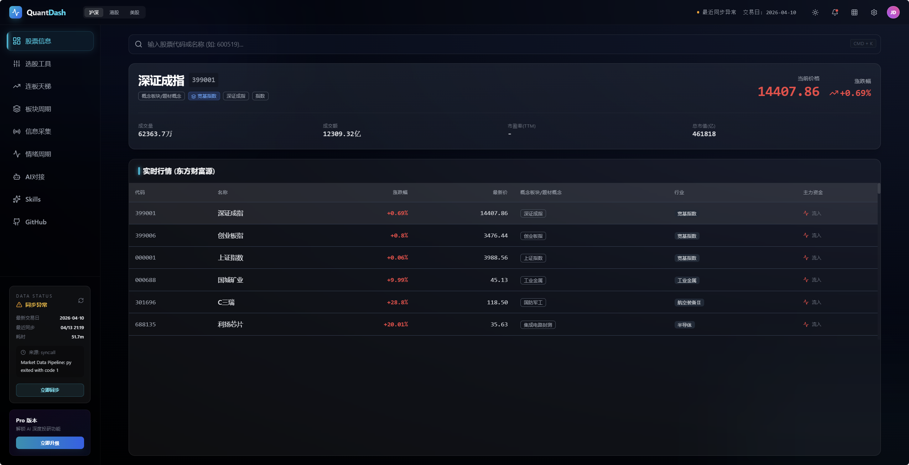
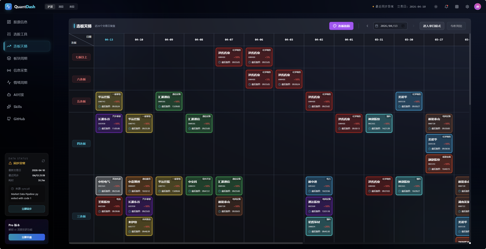
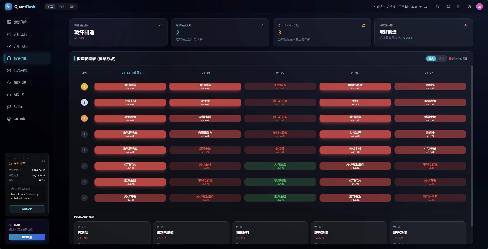
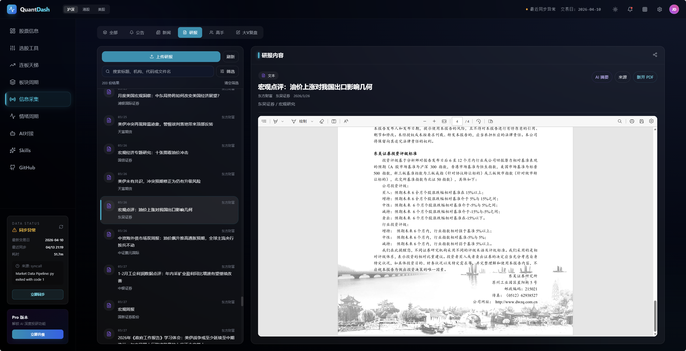
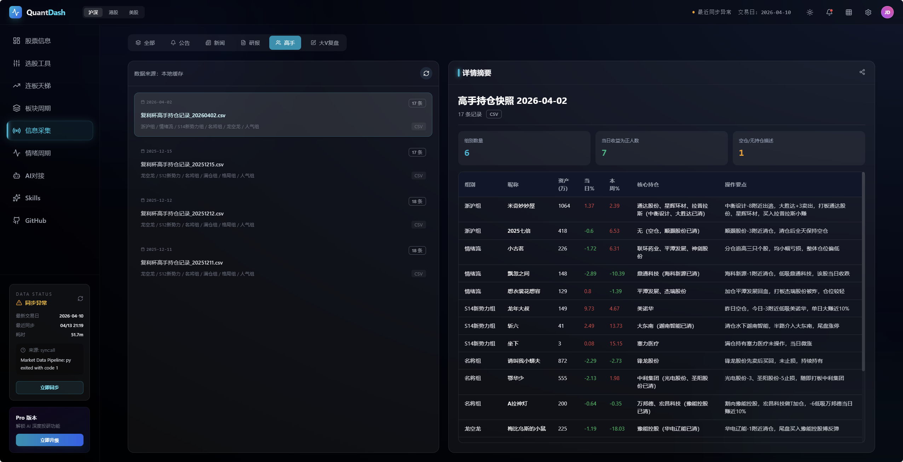
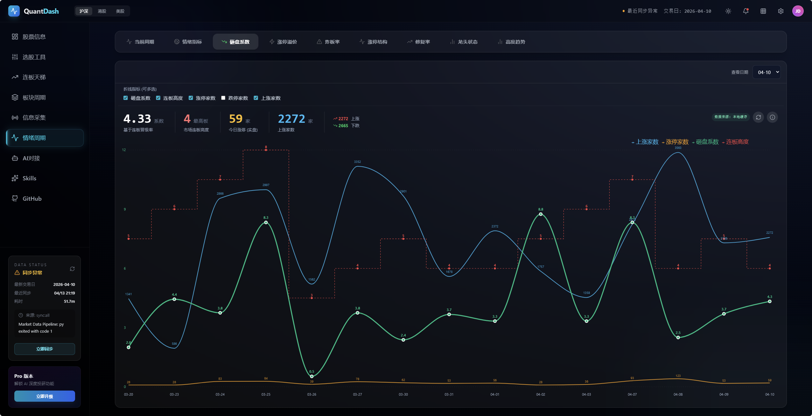
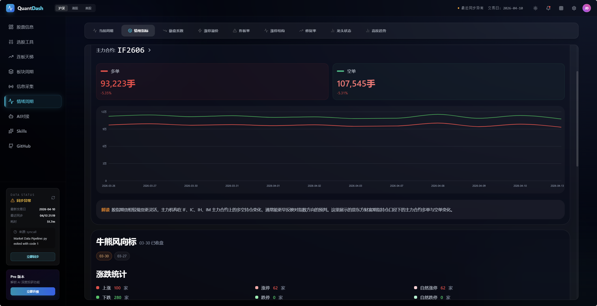
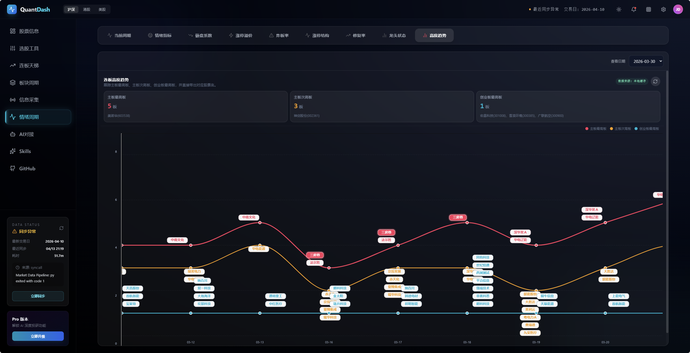
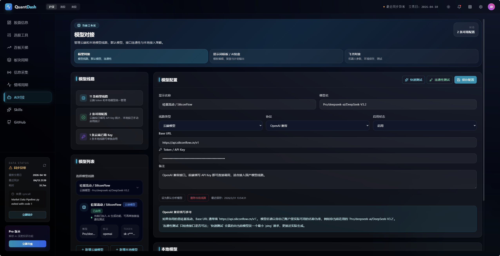
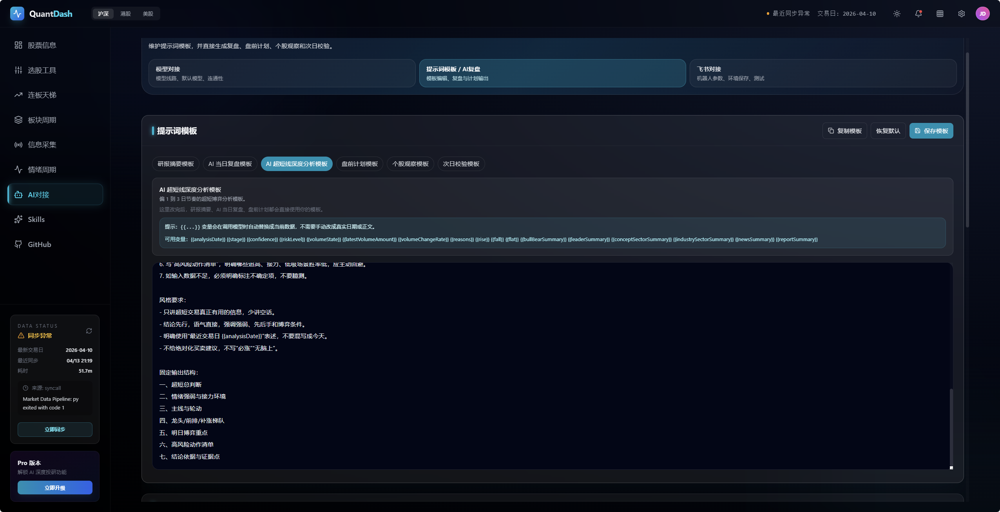
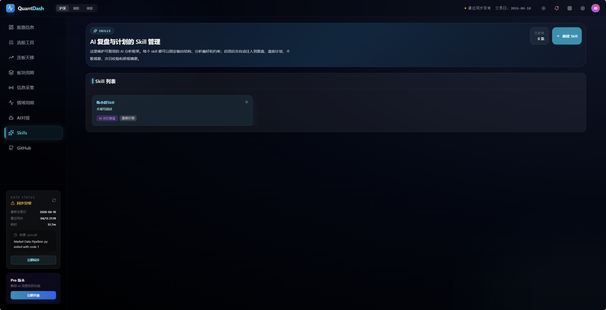


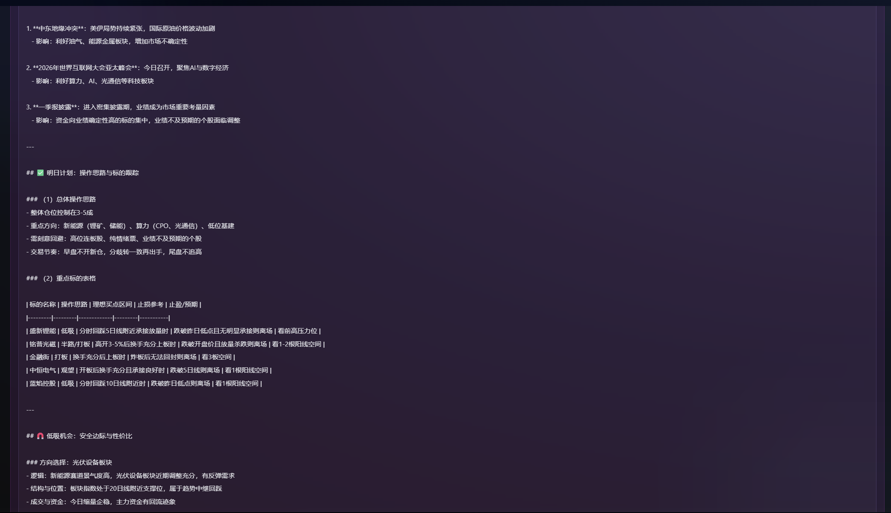
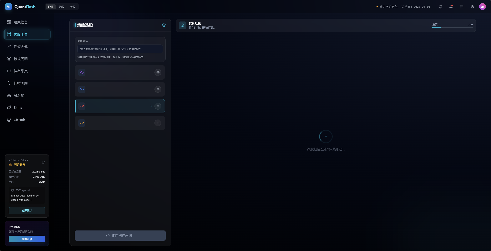
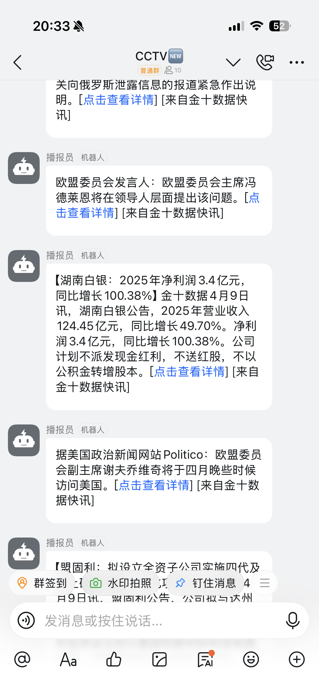

## 许可状态

- 代码许可证：[`PolyForm Noncommercial 1.0.0`](./LICENSE)
- 禁止未经授权的商业使用；如需商业授权，请由项目维护者另行许可
- 公开仓库默认不附带完整本地数据、认证数据库、第三方报告原文或个人研究资料
- 克隆后如需恢复盘后数据，请在本地自行运行 `npm run sync:*` 或 Python 采集脚本生成
- 数据目录公开策略见：[data/README.md](./data/README.md)

## 功能概览

- 市场情绪周期、涨停结构、修复率、龙头状态、高位风险面板
- 个股列表、K 线、单日表现、选股形态识别
- 板块轮动、题材持续性、跨市场情绪指标
- 本地研报清单、研报摘要、重点资讯聚合
- `AI 当日复盘`、`盘前计划`、个股观察
- `Skills` 规则库，可把多个分析 skill 注入到 AI 复盘、盘前计划、个股观察和研报摘要
- 个股悬浮卡支持主图 `MA` 均线开关与缠论结构叠加显示（笔 / 线段 / 中枢）
- 本地 `stdio` MCP Server，供外部 AI 直接读取结构化数据
- 飞书问答机器人，可复用项目内结构化数据和模型线路

## 支持大模型 / 平台

| 模型 / 平台 | 状态 | 备注 |
| --- | --- | --- |
| [OpenAI](https://openai.com/) | ✅ | 可接入任何 OpenAI 兼容接口格式模型 |
| [Ollama](https://ollama.com/) | ✅ | 本地大模型运行平台 |
| [LM Studio](https://lmstudio.ai/) | ✅ | 本地大模型运行平台 |
| [AnythingLLM](https://anythingllm.com/) | ✅ | 本地知识库与文档问答平台 |
| [DeepSeek](https://deepseek.com/) | ✅ | 支持 `deepseek-reasoner`、`deepseek-chat` 等线路 |
| [SiliconFlow 硅基流动](https://siliconflow.cn/) | ✅ | OpenAI 兼容模型聚合平台 |
| [火山方舟](https://www.volcengine.com/product/ark) | ✅ | 豆包等模型接入平台 |

如果你准备找一个省事的模型聚合入口，可以试试 [SiliconFlow 硅基流动](https://cloud.siliconflow.cn/i/uVFj3AbT)。

- 邀请链接：[https://cloud.siliconflow.cn/i/uVFj3AbT](https://cloud.siliconflow.cn/i/uVFj3AbT)
- 邀请码：`uVFj3AbT`

## 快速开始

只启动前端时，最少执行下面两步：

1. `npm install`
2. `npm run dev`

如果还要使用本地数据同步、Python 采集、研报同步或飞书机器人，再安装 Python 依赖并配置环境变量。

统一启动入口：

- 启动项目：`npm run start:project`
- 停止项目：`npm run stop:project`

Windows 仍可继续使用 `start_project.bat` / `start_project.ps1`，macOS / Linux 使用 `start_project.sh` / `stop_project.sh`。

如果你是从 GitHub 公开仓库拉下来的新环境，第一次启动前建议额外执行一次：

`npm run sync:startup-check`

## 本地运行

**前置条件：** Node.js、Python 3

1. 安装依赖：
   `npm install`
2. 如果要运行 Python 采集链路、研报同步或本地选股服务，再安装：
   `pip install -r requirements.txt`
3. 先复制环境变量模板，再按需填写本地配置：
   `Copy-Item .env.example .env.local`
4. 在 `.env.local` 中按需配置环境变量：
   `TUSHARE_API_KEY`
   `TUSHARE_API_BASE_URL`
   `PYWENCAI_COOKIE`
5. 启动开发环境：
   `npm run dev`
6. 生产构建：
   `npm run build`

## 可选环境变量

常用环境变量：

- `TUSHARE_API_KEY`
- `TUSHARE_API_BASE_URL`
- `PYWENCAI_COOKIE`
- `FEISHU_APP_ID`
- `FEISHU_APP_SECRET`
- `FEISHU_BOT_AI_BASE_URL`
- `FEISHU_BOT_AI_API_KEY`
- `FEISHU_BOT_AI_MODEL`

如果只使用前端展示和本地文件读取，这些变量可以先不配置。

如果要使用 `pywencai` 一句话选股，需要在 `.env.local` 中配置 `PYWENCAI_COOKIE`。

公开仓库时不要提交 `.env.local`，只提交 `.env.example`。

## 数据分工

新增界面数据功能前，先看 [STRUCTURED_DATA_RULES.md](./STRUCTURED_DATA_RULES.md)。
新增到界面的数据，先整理成结构化对象，再进入服务层和页面。不要直接把页面拼接结果当数据边界。

技术分工规则：

- `采集优先 Python`
  批量采集、定时任务、历史沉淀、跨页面抓取、全市场扫描放在 Python。
- `展示优先前端`
  页面展示、上传、预览、筛选、交互、浏览器本地存储放在前端 `JS/TS`。
- `Node 负责编排`
  `npm run sync:*`、启动脚本、任务串联、兼容入口放在 Node 层处理。
- `只有明显更优时再例外`
  个别能力放在前端或 Node 更合适时可以例外。

按下面的原则维护：

- `Python / 脚本离线采集`
  用于日频或盘后沉淀的数据，例如情绪周期、涨停结构、炸板率、龙头状态、跨市场情绪指标、A股平均估值、K线库。
- `前端读取本地文件`
  用于展示稳定快照的数据，例如 `data/sentiment.json`、`data/performance.json`、`data/emotion_indicators.json`、研报清单、高手持仓快照。
- `前端实时请求`
  用于轻量、实时性要求高、且失败不影响主流程的数据，例如登录态、用户自选、后端业务 API。

不建议放在前端直接抓的内容：

- 东方财富大盘/全市场统计接口
- 需要留历史的数据
- 依赖全市场扫描才能算出的指标

优先放到 Python 采集链路的数据：

- `emotion_indicators.json`
- `stock_list_full.json`
- `stock_list_chinext.json`
- `sector_rotation_*.json`
- `sector_persistence_*.json`
- `limit_up_structure.json`
- `repair_rate.json`
- `leader_state.json`
- `market_volume_trend.json`
- `high_risk.json`
- `cycle_overview.json`

## 数据目录

项目的数据目录正在迁移到按市场分层的结构。当前代码支持：

- `新路径优先`
- `旧路径兜底`

目录结构示例：

```text
data/
  markets/
    a_share/
      klines/
      single_day_snapshots/
      sentiment.json
      performance.json
      stock_list_full.json
      stock_list_chinext.json
      limit_up_structure.json
      repair_rate.json
      leader_state.json
      market_volume_trend.json
      high_risk.json
      cycle_overview.json
      emotion_indicators.json
      index_futures_long_short.json
      bull_bear_signal.json
    hk/
    us/
  research_reports/
    a_share/
      manifest.json
    hk/
    us/
  system/
    sync_status.json
    auth.db
```

兼容规则：

- 前端和脚本先读取 `data/markets/a_share`、`data/research_reports/a_share`、`data/system`
- 如果新路径下没有文件，会自动回退旧的 `data/*.json` 和 `data/research_reports/*`
- 所以可以先迁代码、再逐步搬文件，不需要一次性切换

继续保留前端直接获取或接口兜底的内容：

- 登录态、自选、业务后端接口
- 页面交互时才需要的临时实时查询
- 本地离线文件缺失时的只读兜底请求

## 服务分层

- `services/quotesService.ts`
  个股列表、K线、单日涨跌、选股形态识别
- `services/chanService.ts`
  缠论结构计算，负责包含处理、分型、笔、线段、中枢
- `services/sectorService.ts`
  板块轮动、板块持续性
- `services/sentimentCycleService.ts`
  情绪周期读取入口
- `services/emotionIndicatorService.ts`
  跨市场情绪指标
- `services/localDataService.ts`
  本地 `data/*.json` 读取
- `services/dataPathService.ts`
  本地数据路径兼容层，处理新旧目录回退
- `services/eastmoneyService.ts`
  东方财富请求和代理兜底

## 数据同步

- 全量同步：`npm run sync:all`
- 盘后主数据同步：`npm run fetch:data`
- Python 主数据同步：`npm run sync:market:py`
- Python K线库同步：`npm run sync:kline:py`
- 情绪周期快照同步：`npm run sync:cycle`
- Python 情绪周期快照同步：`npm run sync:cycle:py`
- 股票快照同步：`npm run sync:stocks`
- 板块快照同步：`npm run sync:sectors`
- Python 股票快照同步：`npm run sync:stocks:py`
- Python 板块快照同步：`npm run sync:sectors:py`
- Python 离线快照同步：`npm run sync:offline:py`
- 跨市场情绪指标同步：`npm run sync:emotion`
- 自动盘后同步：`npm run fetch:data:auto`
- 启动前数据检查：`npm run sync:startup-check`
- 单天项目快照导出：双击 `获取单天数据.bat`，按日期导出到 `data/single_day_snapshots/YYYY-MM-DD.json`
- 历史数据补全：双击 `补全之前数据.bat`，可按 `主市场 / 股票 / 板块 / 周期 / 情绪 / K线` 选择；板块支持继续选 `概念 / 行业 / 全部`

双击 `start_project.bat` / 执行 `start_project.ps1` 时，会先执行一次启动前数据检查。
如果本地数据已是最新交易日，会直接跳过；如果需要跳过这一步，可临时设置：

- `STARTUP_AUTO_SYNC=0`
- `STARTUP_SYNC_MODE=startup` 默认轻量模式，仅检查 `market-core + emotion + sectors + cycle`
- `STARTUP_SYNC_MODE=market` 运行完整主市场链路
- `STARTUP_SYNC_MODE=offline` 运行完整离线同步

`fetch:data` 会一并更新：

- `sentiment.json`
- `performance.json`
- `ladder.json`
- `stock_list_full.json`
- `stock_list_chinext.json`
- `sector_rotation_*.json`
- `sector_persistence_*.json`
- `limit_up_structure.json`
- `repair_rate.json`
- `leader_state.json`
- `market_volume_trend.json`
- `high_risk.json`
- `cycle_overview.json`

采集入口说明：

- `fetch:data`
  主编排入口。先同步最新主数据、股票快照、板块快照、情绪周期快照，不先跑重型 K 线库。
  如需把 K 线库也并入这条链路，可临时设置：`FULL_SYNC_INCLUDE_KLINE=1`
- `sync:offline:py`
  纯 Python 离线快照入口，用于完整补主数据、股票、板块、K线库、情绪指标、情绪周期快照。
- `sync:stocks` / `sync:sectors` / `sync:cycle`
  统一走 Python 采集入口；旧的 JS 文件只保留兼容转发。
- `sync:reports`
  走 Python 采集：抓取东方财富单篇研报列表、详情页摘要、PDF 链接，并保留东方财富总览页和天风证券页面快照。已存在的单篇研报会按 `infoCode` 增量复用，不重复抓详情。
  可选环境变量：
  `REPORT_SOURCE_KEYS=eastmoney-stock-report,eastmoney-industry-report`
  `REPORT_INCLUDE_SNAPSHOTS=0`
  `REPORT_ITEM_LIMIT_OVERRIDE=10`
  `REPORT_DOWNLOAD_PDFS=0`

同步策略：

- 主编排和离线总入口带阶段日志与失败重试。
- 每个阶段默认重试 `2` 次，可用 `SYNC_STAGE_RETRIES` 覆盖。
- 阶段重试间隔默认 `1500ms`，可用 `SYNC_RETRY_DELAY_MS` 覆盖。
- `K线库` 默认只跑 `1` 次，避免大批量任务在失败时重复拉全量数据。
- 可用 `SYNC_STAGES=market-core,stocks,sectors,kline,cycle,emotion,market-pipeline` 只跑指定阶段。
- 编排层会对本地快照做最新交易日检查；已是最新时会直接跳过对应阶段。
- `K线库` 会先按 symbol 做本地预筛；已更新到最新交易日的代码不会重复请求。
- `K线库` 默认只补最近一段滚动窗口数据，并合并进本地历史；更早的缺口不会在日常同步中主动回补。
- 可用 `KLINE_RECENT_LIMIT=30` 调整默认滚动窗口大小。
- 如需强制全量重刷 K 线，可临时设置 `KLINE_FORCE_FULL=1`。
- `sync:all` 默认允许单阶段失败后继续后续阶段，可用 `SYNC_CONTINUE_ON_ERROR=0` 改回失败即停。
- 主编排、离线同步、自动盘后任务都会输出阶段摘要，包含完成、跳过、失败统计。
- `fetch:data`、`sync:offline:py`、`sync:all`、`fetch:data:auto` 会写入 `data/sync_status.json`，保存最近一次同步的交易日、阶段状态、耗时和本地快照日期。
- `sync:emotion` 增加了容错策略：
  - A 股平均估值改为分批抓取 + 截尾均值
  - 请求之间会短暂停顿，降低接口抖动
  - 全市场分页中途失败时，如果前面已有有效数据，会保留已拿到的数据继续生成

## 待办

- 继续丰富 `data/sync_status.json` 的摘要内容，补更多失败原因、跳过原因和阶段级诊断信息。
- Python 采集增加更细粒度失败明细，区分接口请求失败、本地写入失败、数据解析失败。
- `AI对接 > 个股观察` 增加历史时间轴：
  - 按股票维度沉淀不同交易日的 AI 观察结果
  - 展示同一只票在启动、加速、分歧、修复、退潮过程中的判断变化
  - 作为回看个股演化和复盘 AI 判断稳定性的辅助视图
- 规划 `QuantDash + 飞书` 集成方案：
  - 盘后自动把 `AI 当日复盘` 推送到飞书群
  - 盘前自动把 `盘前计划` 推送到飞书
  - 研报抓取结果同步到飞书表格 / 多维表格
  - 大V复盘整理后同步到飞书文档
  - 数据同步失败时发飞书告警
  - 仍按现有项目规则执行：`采集优先 Python`，飞书推送由 Python / Node 编排层完成，前端不承担主推送逻辑

## MCP 接入

项目已内置一个本地 `stdio` MCP Server，供外部 AI 直接读取盘面结构化数据，不需要解析前端页面。

1. 启动 MCP Server：
   `npm run mcp:server`
2. 可用工具：
   `get_market_dashboard`
   `get_leader_state`
   `get_sector_persistence`
   `get_cycle_overview`
   `get_volume_trend`
   `get_high_risk_panel`
   `get_sentiment_snapshot`
   `get_news_feed`
   `get_research_reports`
   `get_research_report_content`
   `get_expert_holding_snapshots`
   `get_expert_holding_snapshot`
3. MCP Server 入口文件：
   [scripts/mcp-server.js](scripts/mcp-server.js)

更完整的 tool 说明见 [AI_MCP_GUIDE.md](./AI_MCP_GUIDE.md)。

使用方式：
AI 通过 MCP 读取结构化数据，再做情绪周期、龙头状态、题材持续性和新闻影响分析，不解析页面 DOM。

## 飞书问答机器人

项目额外提供了一个飞书问答服务，可把 `情绪周期` 数据接到飞书机器人里。
飞书接入代码单独放在 `scripts/integrations/feishu/`。
飞书使用 `长连接 / WebSocket` 事件订阅模式，不需要公网回调地址。

1. 在 `.env.local` 配置：
   `FEISHU_APP_ID`
   `FEISHU_APP_SECRET`
   `FEISHU_BOT_AI_BASE_URL`
   `FEISHU_BOT_AI_API_KEY`
   `FEISHU_BOT_AI_MODEL`
2. 启动服务：
   `npm run feishu:bot`
3. 在飞书开放平台把事件订阅方式切到：
   `使用长连接接收事件`
4. 本机保持该进程运行即可，不需要公网 IP、域名或内网穿透

已实现：

- 支持飞书 `text` 消息长连接接收
- 支持提取消息里的日期，如 `分析 2026-03-27 情绪周期`
- 读取本地 `get_sentiment_snapshot` 同口径数据
- 调用已配置的 `OpenAI 兼容模型`
- 如果模型未配置或调用失败，会回退为本地规则摘要

使用场景：

- 问某一天的情绪周期
- 问最新交易日的盘面判断
- 让 AI 综合参考 `砸盘系数 / 涨停溢价 / 炸板率 / 修复率 / 龙头状态 / 量能 / 高位风险`

## AI 对接

左侧有 `AI对接` 页面。这里做模型接入配置，也承接 `AI 当日复盘`、`盘前计划`、研报摘要等调用。

- 可在页面中维护各家模型线路：
  `ChatGPT / OpenAI`
  `豆包 / 火山方舟`
  `Gemini`
  `DeepSeek`
  `智谱`
  `OpenRouter`
  `Ollama`
  `LM Studio`
  `自定义 OpenAI 兼容`
- 常用模型线路包括：
  `豆包`
  `ChatGPT`
  `Gemini`
  `DeepSeek`
  `GLM`
  默认预置已覆盖。
- 可填写：
  `token / api key`
  `base url`
  `model`
  `备注`
- 页面支持基础 `连通性测试`：
  `OpenAI 兼容接口` 先探测 `/models`
  `Gemini` 探测 `models` 列表
  `Anthropic` 探测 `v1/models`
- 本地模型统一暴露为 `OpenAI Compatible API`，这样同一套配置可兼容 Ollama、LM Studio、vLLM、自建网关。
- 页面会生成可复制的 `mcpServers` 配置片段，便于对接 Claude Desktop、Cherry Studio、Open WebUI 等支持 MCP 的客户端。

使用说明：

- `模型调用` 用你配置的云端或本地模型
- `结构化数据读取` 用本项目内置的 `MCP Server`
- 不要让模型直接解析前端页面 DOM
- `信息采集 > 研报` 支持直接调用已启用模型生成 `AI 摘要`，摘要结果按 `研报 + 模型` 缓存到浏览器本地。
- `AI对接` 页面支持生成 `AI 当日复盘`，分析对象是 `最近交易日`，不是自然日的“今天”。
- `AI对接` 页面支持生成 `盘前计划`，基于最近交易日复盘输出下一交易日观察清单、交易预案和风险提醒。
- `AI 当日复盘` 和 `盘前计划` 支持：
  `一键复制`
  `下载 PDF`（通过浏览器打印窗口另存为 PDF）
- `盘前计划` 会自动提取观察标的代码，并支持一键加入：
  已登录时写入后端自选
  未登录时回退到本地重点关注列表

## Skills

左侧 `Skills` 页面位于 `AI对接` 和 `GitHub` 之间。

这一页不是 GitHub 技能市场，是项目内的 AI 分析规则库。你可以创建多条 skill，并为每条 skill 设置：

- 名称
- 一句话描述
- 直接注入模型的规则指令
- 自动生效范围

自动注入范围：

- `AI 当日复盘`
- `超短深度分析`
- `盘前计划`
- `个股观察`
- `次日校验`
- `研报摘要`

适合写进 Skills 的内容：

- 固定输出结构
- 风险偏好
- 复盘口径
- 禁做事项
- 龙头 / 情绪 / 题材优先级

不要把数据本身写死在 skill 里。skill 用来约束模型的分析方式，不代替输入数据。

## 个股图表与缠论

`股票信息` 里的悬浮图表支持：

- 主图 K 线
- `MA` 均线主图叠加开关
- `BOLL` 主图叠加
- `MACD / KDJ / RSI / BIAS / WR / VR` 副图切换
- 缠论结构开关

缠论结构当前为第一版可视化能力，包含：

- 包含关系处理
- 分型
- 笔
- 线段
- 中枢

补充：

- 中枢采用 `笔级中枢优先，线段级中枢兜底`
- 目前还没有接入 `背驰`、`一二三类买卖点`、`多周期联立`
- 主要用于图形辅助判断，不是严格交易信号引擎

## 许可说明

- 本仓库代码以 [`PolyForm Noncommercial 1.0.0`](./LICENSE) 许可证提供。
- 未经项目维护者额外授权，不得将本仓库代码用于商业用途。
- 仓库不包含 `.env.local`、本地数据库、第三方报告原文、网页快照及个人研究资料。
- 使用、部署或再分发前，请自行确认代码许可与数据来源许可的适用范围。
